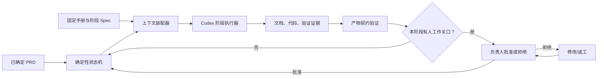

# 架构与决策记录

## 核心模型

流程引擎从不要求模型决定“下一阶段是什么”或“是否已经被批准”。这些是可审计的业务状态，应由普通代码管理。模型只完成当前阶段的开放性工作。

## 为什么第一版使用 Python 标准库

- 教学和 GitHub 试用门槛低，Python 3.10+ 即可运行。
- 没有数据库和 Web 服务，JSON 状态足够表达单工作区流程。
- AI 执行通过独立的 Codex CLI 进程，运行时不需要保存 API key。
- 后续如需多人审批，再将状态存储替换为数据库并增加 Web/API 层。

## 信任边界

| 区域 | 可信职责 | 不允许做的事 |
|---|---|---|
| 状态机 | 阶段顺序、审批、审计 | 生成业务判断 |
| Codex | 读写当前工作区、运行本地验证 | 修改状态、部署、线上写入 |
| 人工审批 | 业务/视觉/权限/上线决策 | 用一句批准掩盖未解决证据 |
| 部署命令 | 执行已配置的单一参数数组 | 未批准时执行、经 shell 拼接任意命令 |

## 失败策略

- AI 进程失败：阶段标记 `failed`，保存错误摘要，不推进游标。
- 必需产物缺失或过短：阶段失败，即使模型声称已完成。
- 人工拒绝：保持在当前关口，后续阶段不可运行。
- 部署失败：保存命令、时间和退出码；不进入“成功”状态。
- 线上目标不可用：线上报告应为失败或阻塞，不应伪造通过。

## 有意保留的 v0.1 限制

阶段返工与下游产物失效需要更细的版本图。第一版选择不可跳过的人工关口，但不自动删除下游文件，以避免隐式破坏用户数据。生产级版本应为每个产物增加内容哈希和 lineage，再实现安全重跑。
