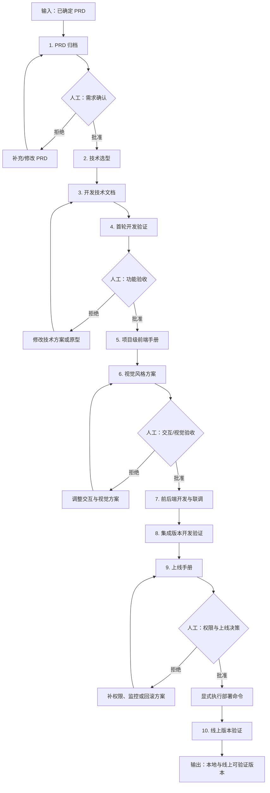
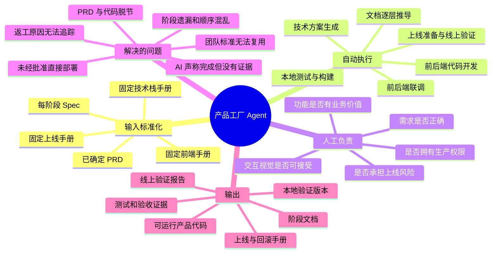

# 产品工厂执行流程与问题地图

## 执行流程

自动阶段可以连续推进；菱形节点必须由人给出可审计的批准或拒绝。拒绝会留在当前关口，不能跳到后续阶段。

## 思维导图：它能解决什么

## 不能替代的事情

- 不能证明一个未经访谈的商业假设一定成立。
- 不能替业务负责人接受需求和经营风险。
- 不能替设计负责人完成主观视觉判断。
- 不能在没有账号、权限和目标环境时证明线上通过。
- 不能保证自动生成代码天然安全、合规或没有缺陷。

它真正减少的是流程遗漏、重复文档劳动和无证据的“口头完成”；它保留的是必须由人承担的判断与责任。
